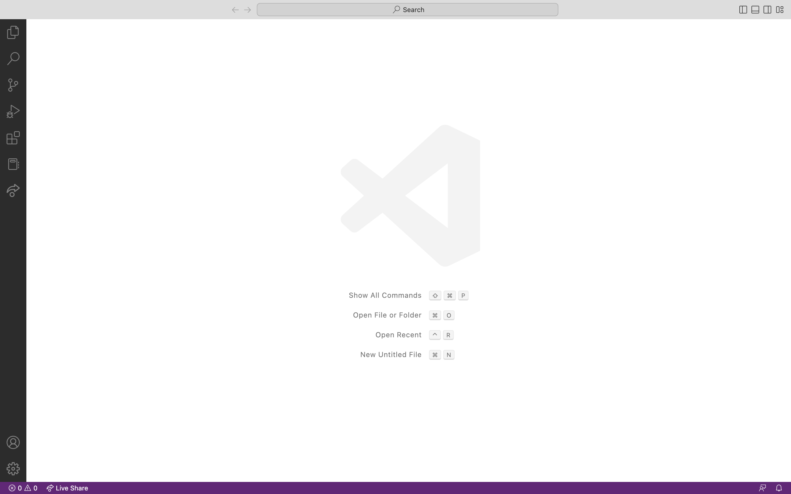
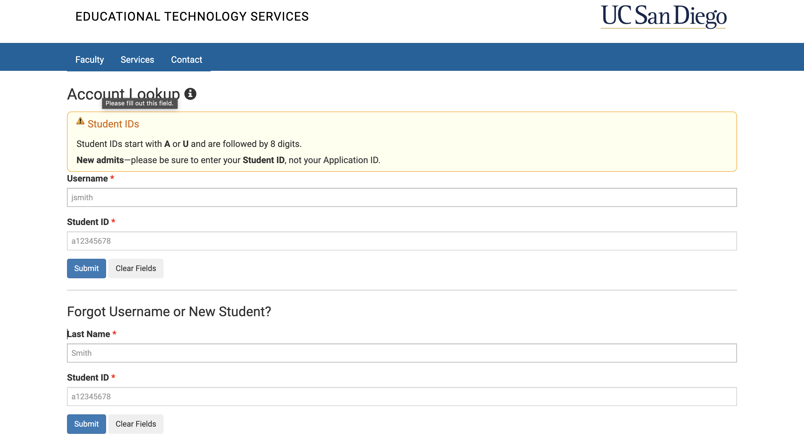
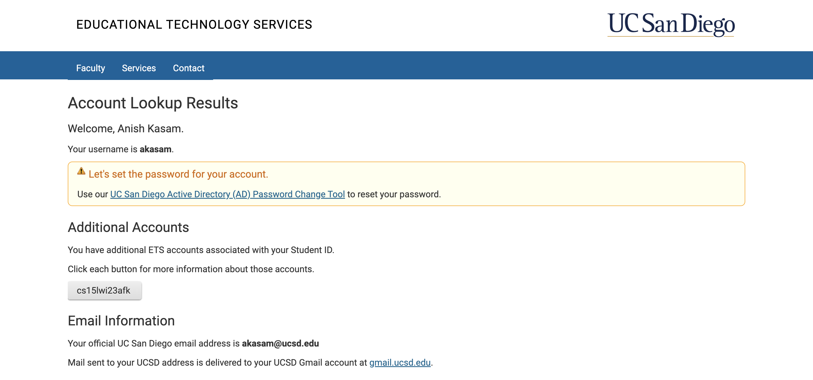
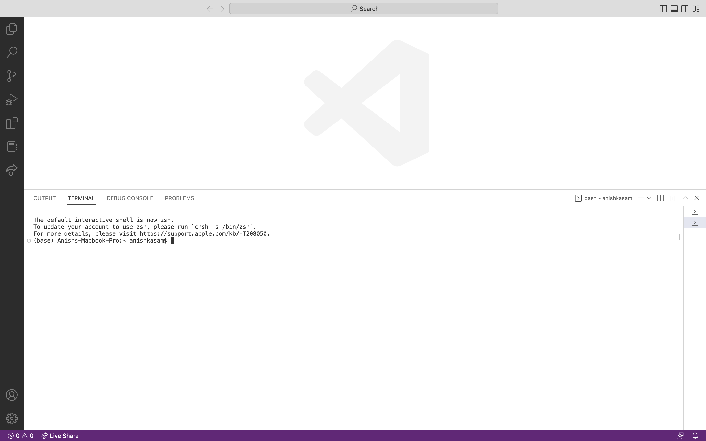
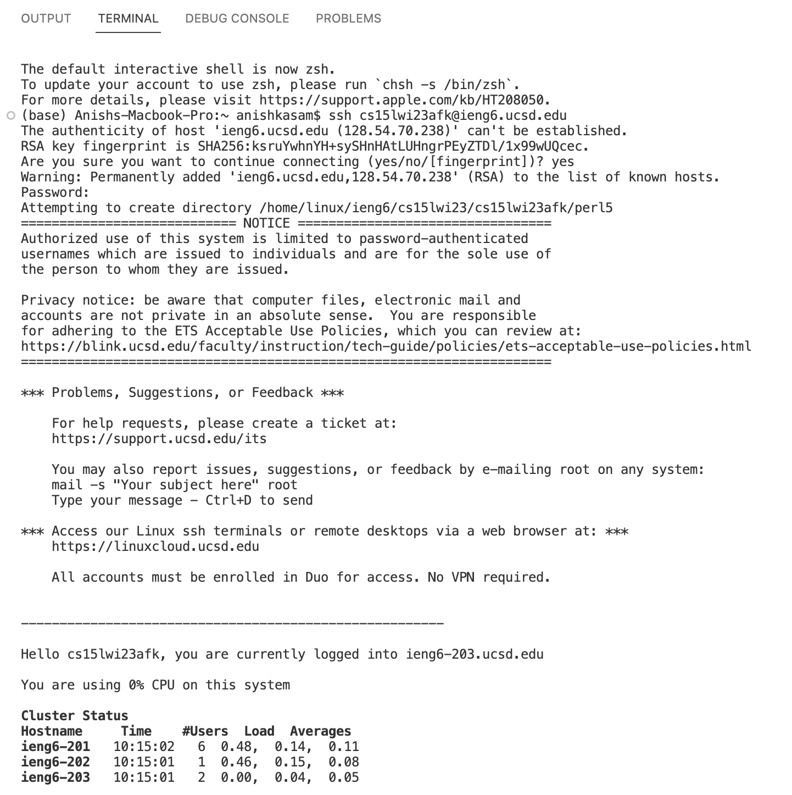
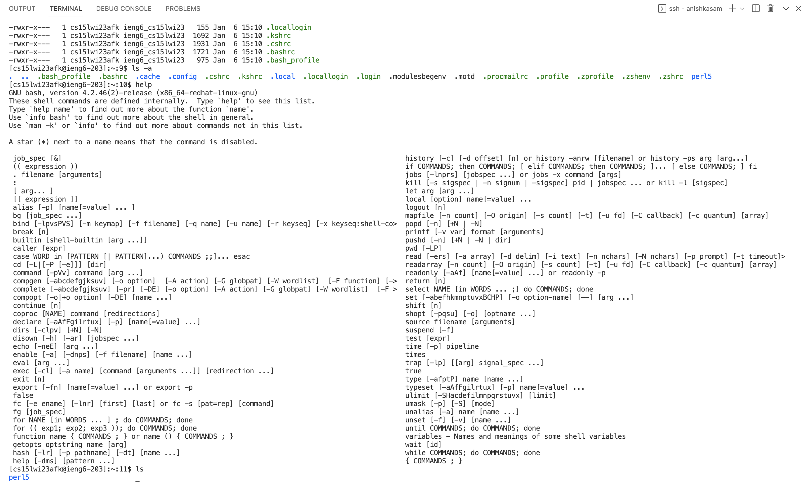

# Week 1 Lab Report

This is a tutorial on how to install Visual Studio Code, log into your course specific account, and run some simple commands in the terminal.

## Installing Visual Studio Code

1. The first step is to go to [Link](https://code.visualstudio.com/) and download the installation that matches your operating system.
2. Follow the prompts your computer gives you to download and install the software.
3. Launch Visual Studio Code, you should see a window that looks something like this:

## Remotely Connecting to Your Course Specific Account

1. In order to connect to your course specific account, you must first look up your account at [Link](https://sdacs.ucsd.edu/~icc/index.php), the website should look something like this:

 

2. In the first two input fields, put in your username and student ID, it should take you to a screen that looks like:

 

3. Under the section **Additional Accounts** you should see a button with your username (from step 3). Click this button, and follow the prompts that show up to change your password.
4. Once you've changed your password go to Visual Studio Code and open a new terminal. You can do this by going to the navigation bar at the top, hovering over **Terminal** and selecting **New Terminal**. Your Visual Studio should now look like this:

 

5. Enter the following command into your terminal with **your username** `ssh cs15lwi23zz@ieng6.ucsd.edu`.
6. The terminal will ask you if you want to continue connecting, type yes.
7. It should then ask you to type in your password (which you just changed), input it and hit enter. The entire process should look like:

## Running Commands in the Terminal

1. Once you have remotely connected to your course specific account, you can run some commands in the terminal!
2. Try typing `ls` into your terminal, this command will list all of the files in your current directory.
3. Try typing 'cd ~', this command will change your directory to your home directory.
4. There are many other commands, here's a list of all of them:

