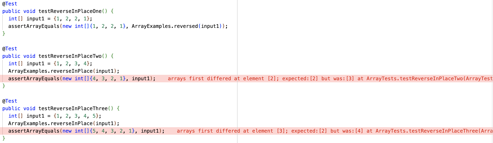

# Week 2 Lab Report

## Part 1

Code for StringServer:


Screenshot #1 of StringServer:


In order to start the server that hosts the String Server, the main method must be called. Within the main method, the handleRequest method in the code is called. In the first screenshot, the code within the "else if" statement is executed.

The argument for the call to the main method is the port number on my local computer where the String Server is hosted, in this screenshot, the server is hosted at port 5001. The argument for the call to the handleRequest method is the URL. In the screenshot above, the URL is "localhost:5001/add-message?s=good%20evening,%20how%20was%20your%20day". 

From the specific request above, the URI is "localhost:5001/add-message?s=good%20evening,%20how%20was%20your%20day". Additionally, the value of the string array parameteres is ["s", "good evening, how was your day"]. As a result, the value of output becomes "good evening, how was your day\n".

Screenshot #2 of StringServer:


Just like the code above, the main method must be called for the server to be hosted. Additionally, the handleRequest method is called from the main method. Furthermore, the specific block of code within the method that is executed is the code that is within the "else if" statement. 

The argument for the call to the main method in the screenshot is also 5001. The argument for the call to the handleRequest method was "localhost:5001/add-message?s=my%20dy%20was%20wonderful,%20how%20was%20yours?".

From the specific request above the URI is "localhost:5001/add-message?s=my%20dy%20was%20wonderful,%20how%20was%20yours?". Additionally, the value of the string array parameters is ["s", "my day was wonderful, how was yours?"]. Since the string output is already defined to be "good evening, how was your day\n", the new query argument is appended to the string. Therefore, the string output becomes "good evening, how was your day\n my day was wonderful, how was yours?\n".

## Part 2

Failure-inducing input for the buggy program:
```
@Test
public void testReverseInPlaceTwo() {
    int[] input1 = {1, 2, 3, 4};
    ArrayExamples.reverseInPlace(input1);
    assertArrayEquals(new int[]{4, 3, 2, 1}, input1);
}
```

Non failure-inducing input for the buggy program:
```
@Test
public void testReverseInPlaceTwo() {
    int[] input1 = {1, 2, 2, 1};
    ArrayExamples.reverseInPlace(input1);
    assertArrayEquals(new int[]{1, 2, 2, 1}, input1);
}
```

The symptom (running the J-Unit tests):


The original code, with the bug:  


The fixed code, with the bug fixed:  


In the original code, the method attempts to move the elements by moving them to the reversed place. For example, if the input array is [1, 2, 3, 4] the method takes the first element and sets it to be the last element. The array then becomes [4, 2, 3, 4]. In the next loop iteration, the array becomes [4, 3, 3, 4]. The problem with this implementation is that the 1 and the 2 of the original array are never stored. Therefore, in the next iteration the array tries to replace the 3rd element with the 2nd element. However, the 2nd element has already been changed. 

In the fixed implementation, the elements of the array are swapped in place. While the buggy implementation attempted to move the elements consecutively, this implementation moves them concurrently. The following is the trace of the function with the input array of [1, 2, 3, 4]. [1, 2, 3, 4] --> [4, 2, 3, 1] --> [4, 3, 2, 1].

## Part 3

Something that I learned from the labs in the past two weeks that I didn't know before was how websites take the information from the query in the URL and use it to customize what the user sees. Prior to the lab, I had programmed using HTML and CSS before and was familiar with paths and controlling what the user sees based on the path of the URL. However, week 2's lab showed me how programs are able to retrieve the argument from the query portion of the URL and alter the experience of the user based on it. I've always wondered how websites were able to used the query, and now I look for queries in all of the URLs of all the websites that I visit.  
