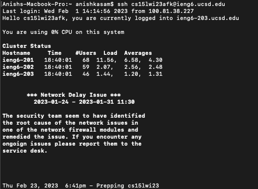
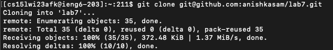
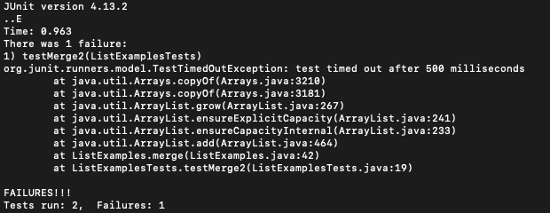
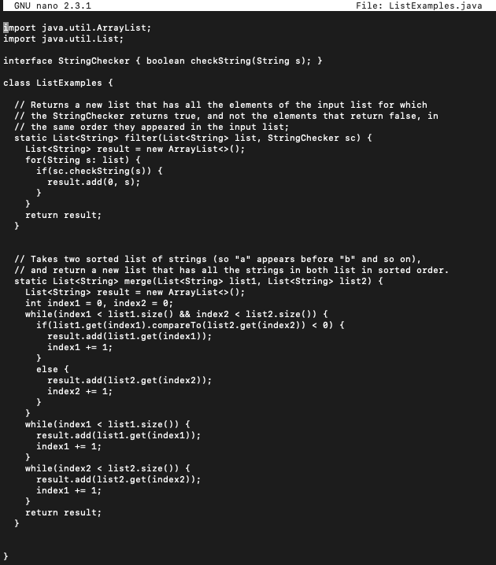
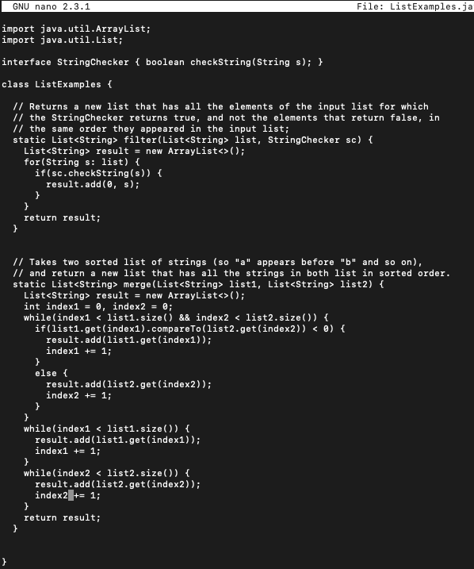
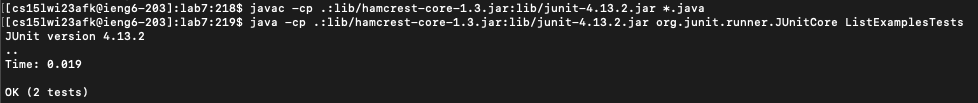
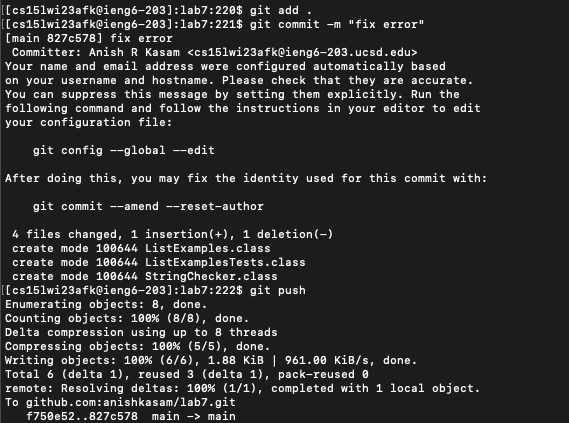

# Lab Report 4

### Delete any existing forks of the repository you have on your account

I went to my GitHub account, and clicked on the fork of the lab7 repository, the screen looked like:  

I clicked on the Settings tab and scrolled all the way down. I clicked on the button that says "Delete this Repository," followed the prompts on the screen and typed in the name of the repository. I saw a screen like this:  

I was already logged into my ieng6 account, so I cd'd out of the repository folder by typing:
`cd .. <enter>`.
This changed my directory to the parent directory.

Then, I deleted the fork from my ieng6 account by typing:
`rm -rf lab7 <enter>`.
This recursively deleted the entire directory.

### Fork the repository

I went to the lab7 repository which is at [Lab 7 Repository](https://github.com/ucsd-cse15l-w23/lab7). I clicked on the Fork button in the top right, and that took me to a screen that looks like this:  

I then clicked on the button that says "Create Fork". 

### Log into ieng6

In order to log into ieng6, I opened my terminal and typed: `ssh cs15lwi23afk@ieng6.ucsd.edu <enter>`. After running this command, my terminal looked like this:  

### Clone your fork of the repository from your Github account

Next I cloned the repository I forked into my ieng6 account. I went back to the GitHub page of my fork and clicked on the green code button. I selected the "SSH" tab and copied the url to my clipboard. I went back to my terminal, and typed the command `git clone <ctrl> v <enter>`. My terminal looked like this:  

### Run the tests, demonstrating that they fail

Once I cloned the repository onto my ieng6 account, I changed my working directory into that repository. I typed `cd lab7 <enter>`. From the course website, I copy and pasted the following command into my terminal: `javac -cp .:lib/hamcrest-core-1.3.jar:lib/junit-4.13.2.jar *.java` and then `<enter>`. Then, I copy and pasted the next command from the course website into my terminal: `java -cp .:lib/hamcrest-core-1.3.jar:lib/junit-4.13.2.jar org.junit.runner.JUnitCore`, I then typed `ListExamplesTests <enter>`. These two commands compiled the java files and ran the unit tests in the tester file. My terminal displayed the following message:  

### Edit the code file to fix the failing test

From the error message, I knew that the problem with the code was in line 42 of the ListExamples.java file. So I typed the command `nano Li<tab>.java` in order to autocomplete the file name and then open a text editor within my terminal to fix the error. Using my down arrow key repeatedly, I went down to line 42 and updated the increment statement in the last while loop to increment index2, rather than index1. This is the code before the change:  

This is the code after the change:  

In order to save my changes and close the nano editor, I typed `<ctrl> o` and `<ctrl> x`. 

### Run the tests, demonstrating that they now succeed

In order to run the tests again, I used the up arrow key, since they are the same lines of code from the first time I ran the tests. To recompile the java files, I typed `<up><up><up><enter>`. This compiled all of the java files. Then, in order to run the unit tests, I typed `<up><up><up><enter>`. This ran all the tests, and this time they all passed. My terminal looked like:  

### Commit and push the resulting change to your Github account (you can pick any commit message!)

In order to push my changes to GitHub, I first typed `git add . <enter>` to add all my changes.
Then, I created a commit with a message by typing `git commit -m "fix error" <enter>`.
Finally, I pushed my changes to GitHub, by typing `git push`. My terminal output was:

