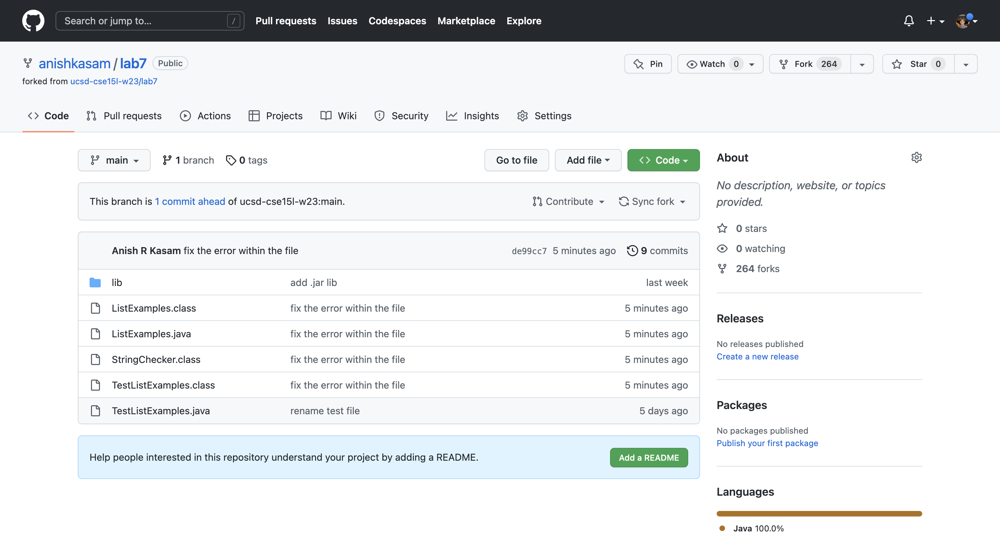
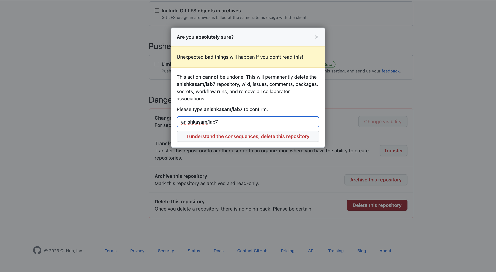
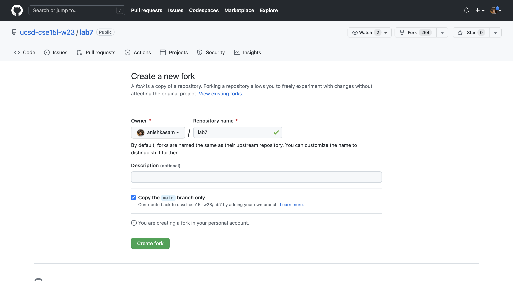

# Lab Report 4

### Delete any existing forks of the repository you have on your account

Go to your GitHub account, and click on your fork of the lab7 repository. You should see a screen like this:

Click on the Settings tab and scroll all the way down. Click on the button that says "Delete this Repository," follow the prompts on the screen and type in the name of the repository. You should see a screen like this:

If you are already logged into your ieng6 account in the terminal, cd out of the repository folder by typing:
`cd ..`.
This changes your directory to the parent directory.

Then delete the fork from your ieng6 account by typing:
`rm -rf lab7`.
This recursively deletes the entire directory.

### Fork the repository

Go to the lab7 repository which is at [Lab 7 Repository](https://github.com/ucsd-cse15l-w23/lab7). Click on the Fork button in the top right, and that should take you to a screen that looks like this:

Click on the button that says "Create Fork". 

### Log into ieng6

### Clone your fork of the repository from your Github account

### Run the tests, demonstrating that they fail

### Edit the code file to fix the failing test

### Run the tests, demonstrating that they now succeed

### Commit and push the resulting change to your Github account (you can pick any commit message!)
